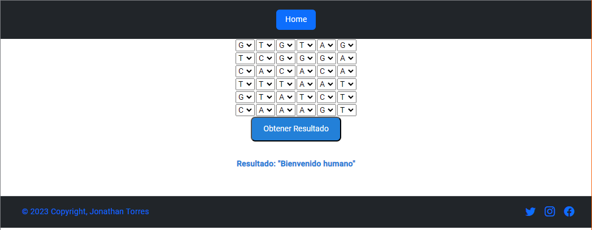

# SETI-Test-Frontend

Desarrollo de proyecto para ejercicio de prueba en la empresa SETI, este frontend esta desarrollado en **Angular** 15, **TypeScript**, implementa MVC.

Problema practico

Te ha contratado a ti para que desarrolles un proyecto que detecte si un humano es mutante basándose en su secuencia de ADN.
Para eso te ha pedido crear un programa con un método o función con la siguiente firma (En alguno de los siguientes lenguajes: (JavaScript (node)):

isMutant ( dna:string[] ): boolean

En donde recibirás como parámetro un array de Strings que representan cada fila de una tabla de (NxN) con la secuencia del ADN. Las letras de los Strings solo pueden ser: (A,T,C,G), las cuales representa cada base nitrogenada del ADN.

Sabrás si un humano es mutante, si encuentras más de una secuencia de cuatro letras iguales, de forma oblicua, horizontal o vertical.

Ejemplo (Caso mutante):

const dna = {"ATGCGA","CAGTGC","TTATGT","AGAAGG","CCCCTA","TCACTG"};
En este caso el llamado a la función isMutant(dna) devuelve “true”.

Desafíos:
1.	Desarrolla el algoritmo de la manera más eficiente posible (Angular).
2.	Se debe construir una pantalla que permite ingresar el dna y validar si es o no mutante. (La creatividad tendrá puntuación).
3.	Cargar y documenta el proyecto en un repositorio de git.

# Solve

# About

  

This project was generated with [Angular CLI](https://github.com/angular/angular-cli) version 15.2.4.

  

## Development server

  

Run `ng serve` for a dev server. Navigate to `http://localhost:4200/`. The application will automatically reload if you change any of the source files.

  

## Code scaffolding

  

Run `ng generate component component-name` to generate a new component. You can also use `ng generate directive|pipe|service|class|guard|interface|enum|module`.

  

## Build

  

Run `ng build` to build the project. The build artifacts will be stored in the `dist/` directory.

  

## Running unit tests

  

Run `ng test` to execute the unit tests via [Karma](https://karma-runner.github.io).

  

## Running end-to-end tests

  

Run `ng e2e` to execute the end-to-end tests via a platform of your choice. To use this command, you need to first add a package that implements end-to-end testing capabilities.

  

## Further help

  

To get more help on the Angular CLI use `ng help` or go check out the [Angular CLI Overview and Command Reference](https://angular.io/cli) page.

# Tecnologias usadas

 - [x] TypeScript
 - [x] Angular 15.2.4
 - [x] Angular Material
 - [x] Bootstrap
 - [x] Jquery
 - [x] Rxjs
 - [x] HTML5
 - [x] SCSS

# Responsable

| [ JonSteve](https://github.com/jonstevet) |
| :---: |